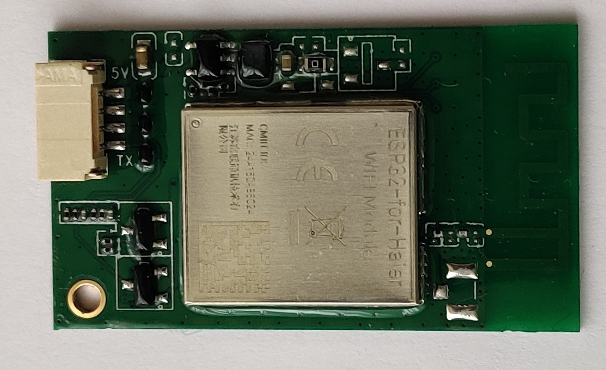
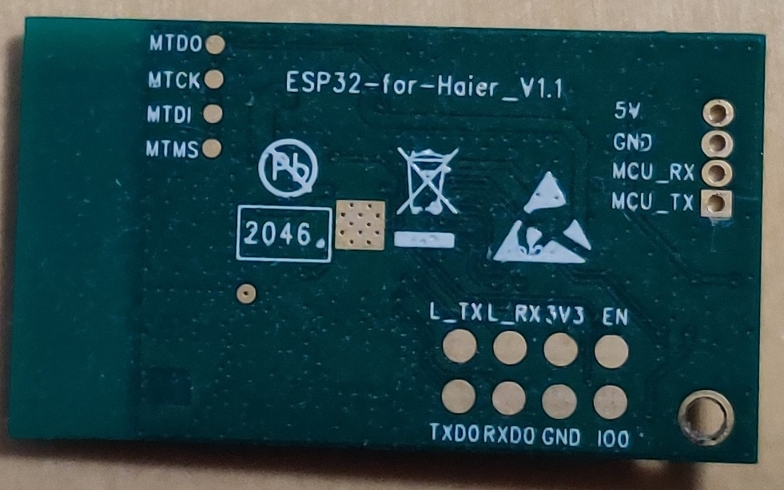

# ESP32-S0WD-Haier
Project based on [ivoh95/ESPHome-Haier](https://github.com/ivoh95/ESPHome-Haier.git)

This is implementation of Haier Airco protocol on the base of ESPHome for native ESP32 board so you can controll your AC in home assistant

That is how native Haier ESP32 board looks like. 

**Front:**

**Back:**

To flash firmware you will need to use USB to TTL converter and UART0 on board

**UART0 pinout:**

Flashing instruction: [Flashing the firmware](https://nodemcu.readthedocs.io/en/latest/flash/)
