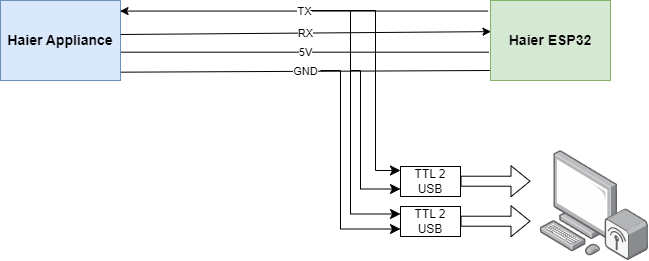

Sniffing Serial Communication with Two TTL to USB Adapters
==========================================================

Introduction
------------
Serial communication is a cornerstone in many electronic systems, allowing various devices to communicate over relatively simple connections. In some cases, you may need to intercept or "sniff" this communication to debug or understand the data exchange between two devices. This guide will show you how to use two TTL to USB adapters to sniff serial communication.

Requirements
------------
- Two TTL to USB adapters
- Computer with USB ports
- Serial communication software (such as PuTTY or Termite)
- Breadboard and jumper wires
- Target devices communicating via TTL serial

Steps
-----
Follow these steps to set up your sniffing station:

1. **Connect the Adapters**

   Connect each TTL to USB adapter to your computer's USB ports. Note the COM port numbers assigned to each adapter by your operating system. You can find this information in the Device Manager on Windows or using the `dmesg` command on Linux.

   .. image:: images/usb_adapters.png
      :alt: TTL to USB adapters connected to a computer

2. **Wire the Adapters to the Target Devices**

   Identify the TX (Transmit) and RX (Receive) pins on your target devices. Typically, these will be marked on the device or in its documentation.

   - Connect the TX pin of the first device to the RX pin of the first TTL adapter.
   - Connect the RX pin of the first device to the TX pin of the second TTL adapter.
   - Connect the TX pin of the second device to the RX pin of the second TTL adapter.
   - Connect the ground (GND) of the target devices to the ground pins of both TTL adapters.

   .. image:: images/wiring_diagram.png
      :alt: Wiring diagram for TTL to USB adapters and target devices

3. **Configure Serial Communication Software**

   Open two instances of your preferred serial communication software. Configure each instance to listen to one of the COM ports assigned to the TTL adapters. Make sure to set the baud rate, data bits, parity, and stop bits according to the specifications of your target devices.

   .. image:: images/setup_diagram.png
      :alt: Screenshot of serial communication software configuration

4. **Start Sniffing**

   With everything connected and configured, you should start seeing data being transmitted between the target devices in both instances of your serial communication software. One instance will show the data sent from the first device, and the other will show the data sent from the second device.

   .. image:: images/sniffing_data.png
      :alt: Data being sniffed in serial communication software

Troubleshooting
---------------
- **No Data Displayed**: Check the connections and ensure that the TX and RX pins are correctly wired. Verify the COM port numbers and settings in the serial communication software.
- **Garbled Data**: Ensure that the baud rate and other communication settings match those of the target devices.
- **Intermittent Data**: Check for loose connections and ensure that the ground connections are secure.

Conclusion
----------
Using two TTL to USB adapters is an effective way to sniff serial communication between two devices. This method allows you to monitor and debug communication issues, ensuring your systems function as intended.

.. note::

   Always ensure you have permission to intercept and monitor communication between devices, especially in production environments or with proprietary hardware.

.. image:: images/completion.png
   :alt: Successful completion of the setup

By following these steps, you can set up a reliable serial communication sniffing station and gain valuable insights into the data exchange between your devices.
